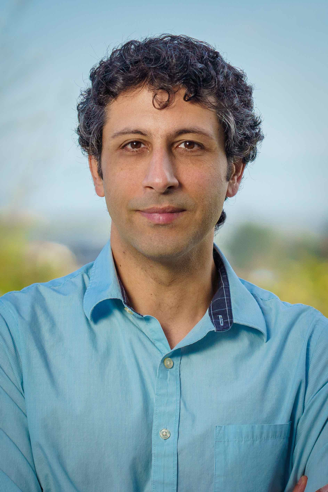

* Associate Professor
* Joan and Irwin Jacobs Chancellor's Endowed Faculty in Genome Engineering II
* [ECE](http://ece.ucsd.edu) Department, [University of California, San Diego](http://ucsd.edu)
* Affiliated with the [CSE department](http://cse.ucsd.edu/), [Bioinformatics](http://bioinformatics.ucsd.edu/faculty_bisb), and [Center for Microbiome Innovation](http://jacobsschool.ucsd.edu/microbiome/faculty.sfe).

I obtained my Ph.D. from the Computer Science department at UT-Austin and was advised by [Prof. Tandy Warnow](http://tandy.cs.illinois.edu) and [Prof. Keshav Pingali](http://www.cs.utexas.edu/~pingali/). 
My Ph.D. research was supported by an NSERC PGS award and [Howard Hughes Medical Institute international student fellowship](http://www.hhmi.org/news/20120725.html). 
My [dissertation](https://repositories.lib.utexas.edu/bitstream/handle/2152/31377/MIRARABBAYGI-DISSERTATION-2015.pdf) won the [honorable mention for the 2015 ACM Doctoral Dissertation Award](http://www.acm.org/awards/2015-doctoral-dissertation). 
I have been a recipient of the [2017 Sloan Research Fellowship](https://sloan.org/fellowships/2017-Fellows) in Computational & Evolutionary Molecular Biology, the [NSF CAREER award](https://nsf.gov/awardsearch/showAward?AWD_ID=1845967&HistoricalAwards=false), and the [MIRA award from NIGMS at NIH](https://reporter.nih.gov/search/73g1sqOpP0y0A6uXFguibw/project-details/10275055). More recently, the great work of [my students](students.html), including several [award winning contributions]({{ site.url }}/2021/08/10/student-awards.html), has put my name on the list of [Clarivate Highly Cited Researcher of 2023](https://clarivate.com/highly-cited-researchers/?utm_campaign=EM1_Congrats_Winners_Highly_Cited_Researchers_Retention_AG_Global_2023)
and [Clarivate Highly Cited Researcher of 2024](https://clarivate.com/highly-cited-researchers/?utm_campaign=EM1_Congrats_Winners_Highly_Cited_Researchers_Retention_AG_Global_2024).
I contribute to many international projects and am part of the counsil of the [Vertebrate Genome Project](https://vertebrategenomesproject.org/who-we-are).

I am not offended by any pronouncination of my name, so, don't worry about it. If you wonder, [here]({{ site.url }}//assets/name.m4a) is how I pronounce it.
I have noticed that most native speakers are more comfortable starting my name with a Sh sound rather an S; so my only tip is, start with an S not a Sh and take it from there. 

### Research

Mirarab lab focuses on **computational biology** with a specific focus on developing methods that target evolutionary analyses on large-scale datasets. 
These algorithms infer statistically rigorous estimates of evolutionary histories based on genomic data and use the results of such inferences in downstream applications.
The techniques used range from classic algorithms (dynamic programming) to graph theory and statistical inference. 
More recently, we have started incorporating machine learning techniques that can integrate biological domain knowledge. 
High accuracy and scalability are the main focal points, with the idea that gains in scalability should not come at the expense of accuracy. 
While all the algorithms have heoretical underpinnings, much attention is paid to the empirical evaluation of methods under challenging conditions. 
The lab prides itself on developing many [tools](software.html) that are widely used by biologists (e.g., ASTRAL series) and have paved new directions (e.g., Skmer, DEPP). 
We strive to make these useful for biologists and often hold [tutorials](http://github.com/smirarab/tutorials/) and workshops for providing training in the use of the tools. 
Biological applications explored by the lab include reconstruction of species trees from gene trees (phylogenomics), the study of biodiversity using low coverage genomic data (genome skimming), metagenomic analyses using phylogenetic and machine learning approaches, HIV transmission network reconstruction, and large-scale multiple sequence alignment. 
What unites these wide-ranging applications is their reliance on evolutionary trees as an underlying model. 

* Check out our [publications](publications.html) page. 
* See our [tools](software.html) though this page is often behind our latest developments. 
* Here is my (hopefully up-to-date) [**CV**]({{ site.url }}/assets/resume-mirarab.pdf).
* Most our presentations are available [here](presentations.html).
* Look [here](news.html) for miscellaneous information. 

### Students

I am proud of amazing [students](students.html) who have been in my lab.

* Prospective students: note that  decisions are made by a committee in our department.  
  In rare circumstances, if you have done work that is very closely related to my work, you can write to me and bring that to my attention.  
* Incoming and new students are encouraged to check out [this page]({{ site.url }}/2015/09/12/material-for-prospective-students.html) to learn about the background used in my work 
* ECE students without sufficient programming background may find [this page]({{ site.url }}/2017/03/26/programming.html) useful. 

And my calendar:

<iframe src="https://www.google.com/calendar/embed?height=600&amp;wkst=1&amp;bgcolor=%23FFFFFF&amp;src=smirarab%40gmail.com&amp;color=%232952A3&amp;src=en.usa%23holiday%40group.v.calendar.google.com&amp;color=%23125A12&amp;src=smirarabbaygi%40ucsd.edu&amp;color=%13125C12&amp;ctz=America%2FLos_Angeles" style=" border:solid 1px #777 " width="800" height="600" frameborder="1" scrolling="yes"></iframe>

Finally, a link to some useful material on our [lab wiki](https://github.com/mirarablab/wiki).
